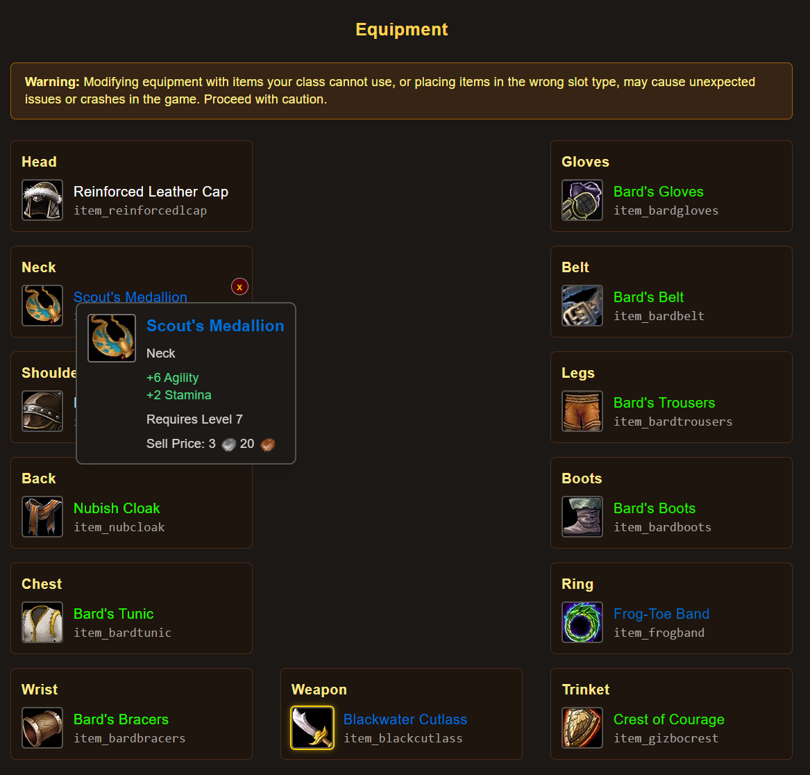
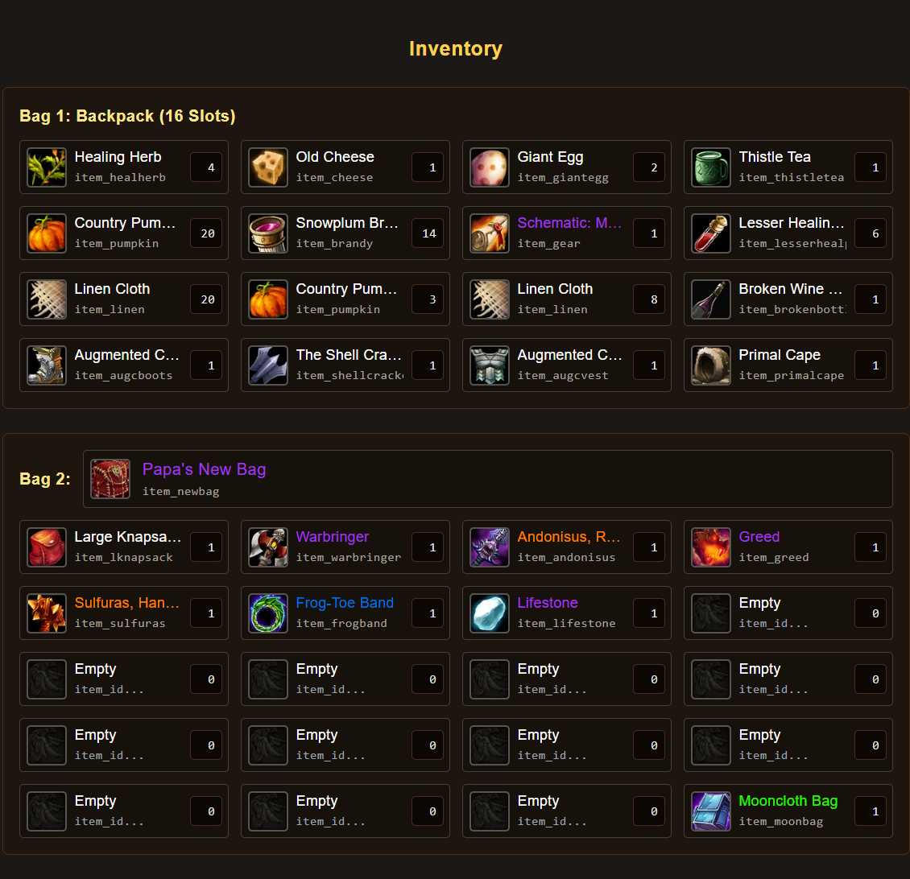
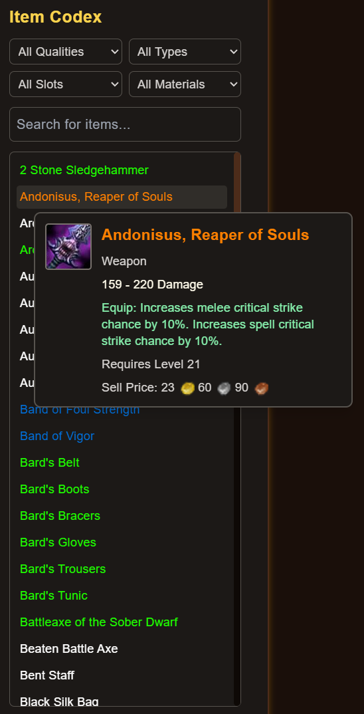

> [!WARNING]
> ⚠️ Project Status: Early Alpha 🧪

> [!IMPORTANT]
> 🔧 Some features or functionality may be incomplete or unstable.  
> 💬 Feedback and bug reports are very welcome!

# ⚔️ Murloc 2 Hero Editor

A save file editor for the classic SWF Flash RPG **Murloc 2: Episode 1**.

Inspired by tools like the Diablo II Hero Editor

# ❓ What is it for ?

This project allows you to directly modifying the hash-encrypted game’s save file.  
Since **Murloc 2** stores player data in local save files with a checksum/hash to prevent tampering.  
This tool can edit game saves and regenerate the correct hash automatically, so the game will accept your edited save.

---

## ✨ Features

- 📂 **Load & Edit Save Files** – Open your `Murloc2.sav` file and view character stats, quests, and inventory.  
- ⚔️ **Modify Hero Attributes** – Change level, gold, and more.  
- 🧩 **Equipment & Inventory Editing** – Add/remove items or adjust quantities.  
- 🔒 **Checksum/Hash Regeneration** – Regenerate corrected hash after edits so the game won’t reject your save.  
- 🕹️ **Classic Flash Game Compatibility** – Works with the local save format from the original `.swf` release.  
- 📖 **Item Codex/Database** – Search or filter to quickly find items.  
- 🖥️ **GUI-Based Editor** – Simple interface for browsing and modifying data.  

---

## 🚀 Usage

> [!CAUTION]  
> 💾 Always **back up your saves** before editing!  
> ⚡ Use at your own risk!

1. 🔍 Locate your exported **murloc-2.sav** file.  
2. 📂 Import save file in [**Murloc 2 Hero Editor**](https://murloc-rpg-2-hero-editor.vercel.app).  
3. ✏️ Modify your stats, inventory or equipments.
4. ⏩ Click **Reforge Seal** to generate the save file json.
5. 💾 **Export** or **replace** your original save file with the edited version.  
6. 🕹️ Load your save file and enjoy!

## 📷 Screenshots (WIP) 🖼️

  
  
  

---

## ⚖️ Disclaimer

This project is a **fan-made tool** and is not affiliated with or endorsed by **Newgrounds** or **MaskedVillain** (the original creator of *Murloc 2 Game*).  
It is intended for educational purposes and for preserving/modding classic Flash games.  
